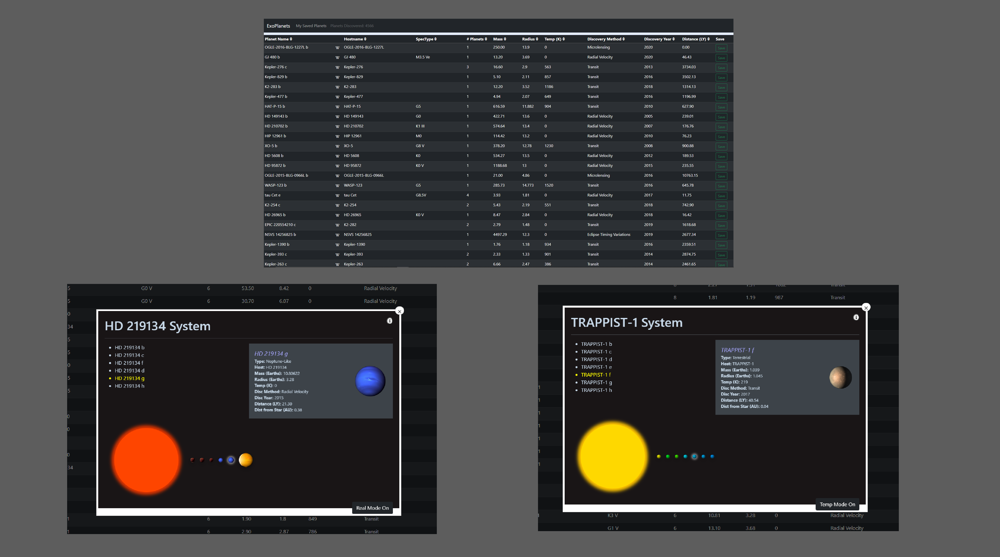
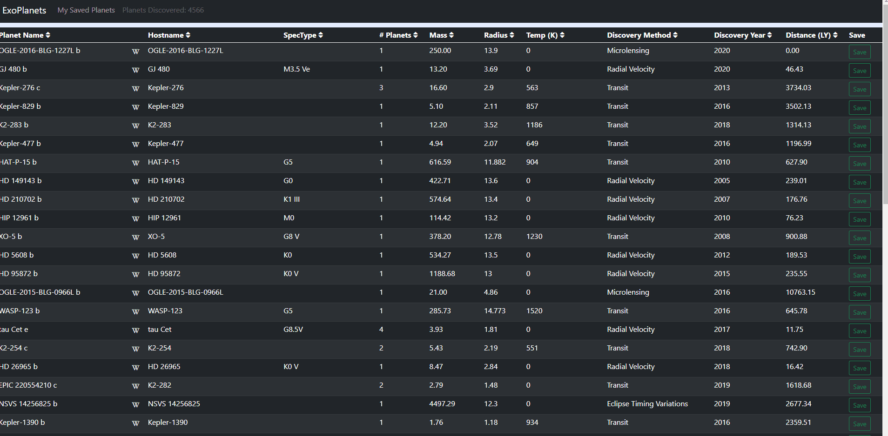
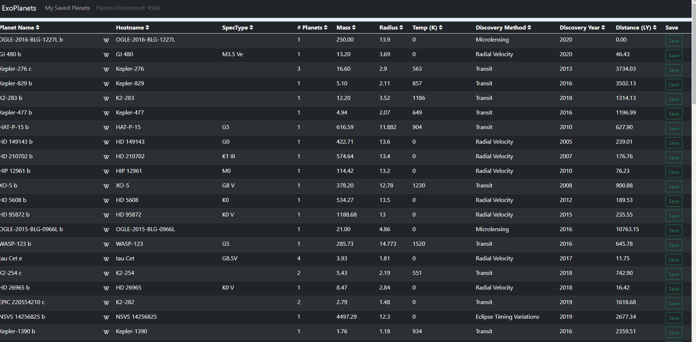
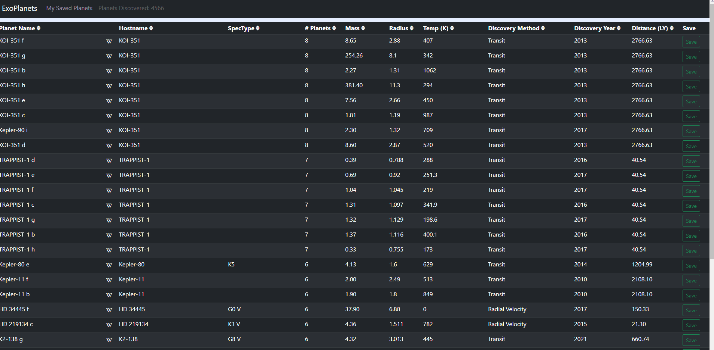

# ExoPlanets Explorer

### Available here: https://exoplanets-explorer.herokuapp.com/

ExoPlanets Explorer is a React.js application with a Spring Boot API that shows a real time list of all known exoplanets currently discovered. All exoplanet data is sourced from Nasa's Exoplanet Archive API found here: https://exoplanetarchive.ipac.caltech.edu/docs/program_interfaces.html

This application displays a list of all known exoplanets and data, allows the user to save and delete planets to their saved planets, and displays the system visually when the host name of the planet is clicked in the table.

# Features
## Displays real-time exoplanets and data in a table

Current available data:
- Planet Name
- Hostname
- Star Spectral Type
- Number of planets in system
- Mass
- Radius
- Temperature (K)
- Discovery Method (Transit, Microlensing, Radial Velocity, and Eclipse Timing Variations)
- Discovery Year
- Distance (LY)

Additional Data in planet info section of system visual
- Planet Type (based on mass: Terrestrial, Super-Earth, Neptune-Like, and Gas-Giant)
- Distance from host (AU) 

---
## Quickly sort Exoplanet data by any parameter

Allows for fast rendering after sorting by implementing an Infinite Scroll so it only renders data as needed. Null values are added to the end.

---
## Allows planets to be saved for later viewing

---
## Displays visual representation of system when the host name of a planet is clicked in the table

Popup Features
- Shows a visual representation of the system in a popup. It will show the star with a different color based on the star spectral type (O, B, A, F, G, K, M). It defaults to yellow if there is no spectral data for that system.
- Planets are ordered by distance from star.
- Planet sizes are to scale relative to each other.
- Planet images are based on planet type (Terrestrial, Super-Earth, Neptune-Like, and Gas-Giant)
- Planet Temperature is displayed by color when Temp Mode is on. Color is based on habitability. If displayed in a shade of green (273 - 373 K), it has a planet surface temperature that can support liquid water. A shade of blue will be too cold, and a shade of red to yellow will be too hot for liquid water. The color defaults to gray if no temperature data is available for that planet.
- Displays legend for star spectral type and planet temperature by color when the info button in the top right corner is clicked.

---
## Learn more about any planet by clicking the wiki link next to its name

---
